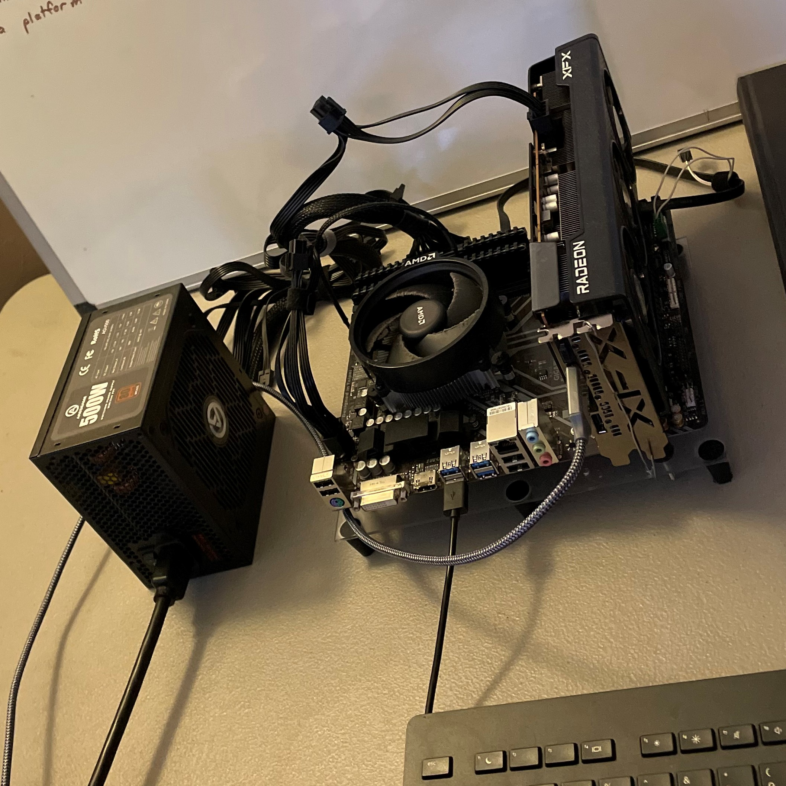
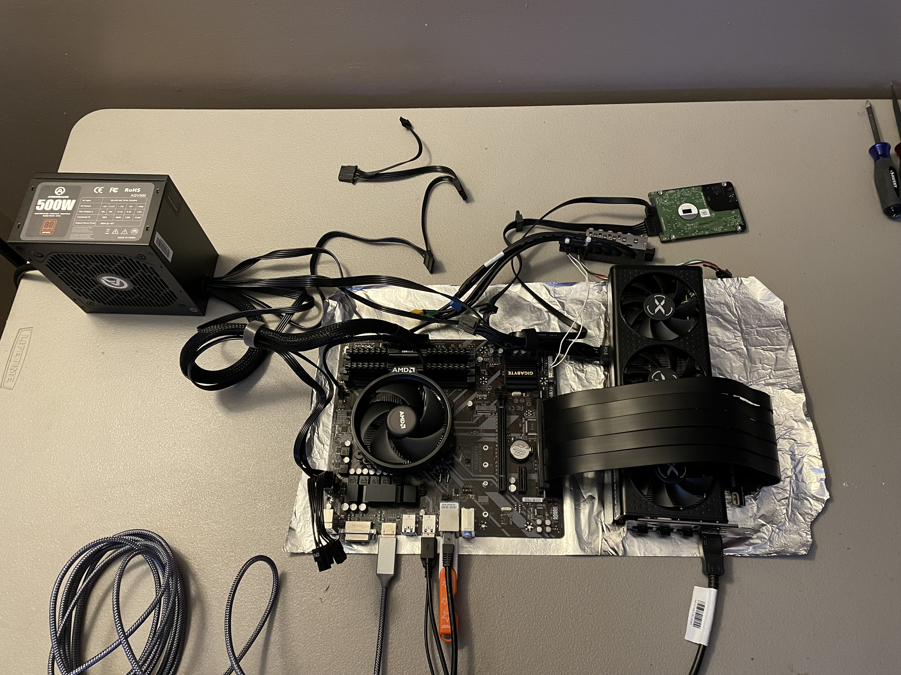
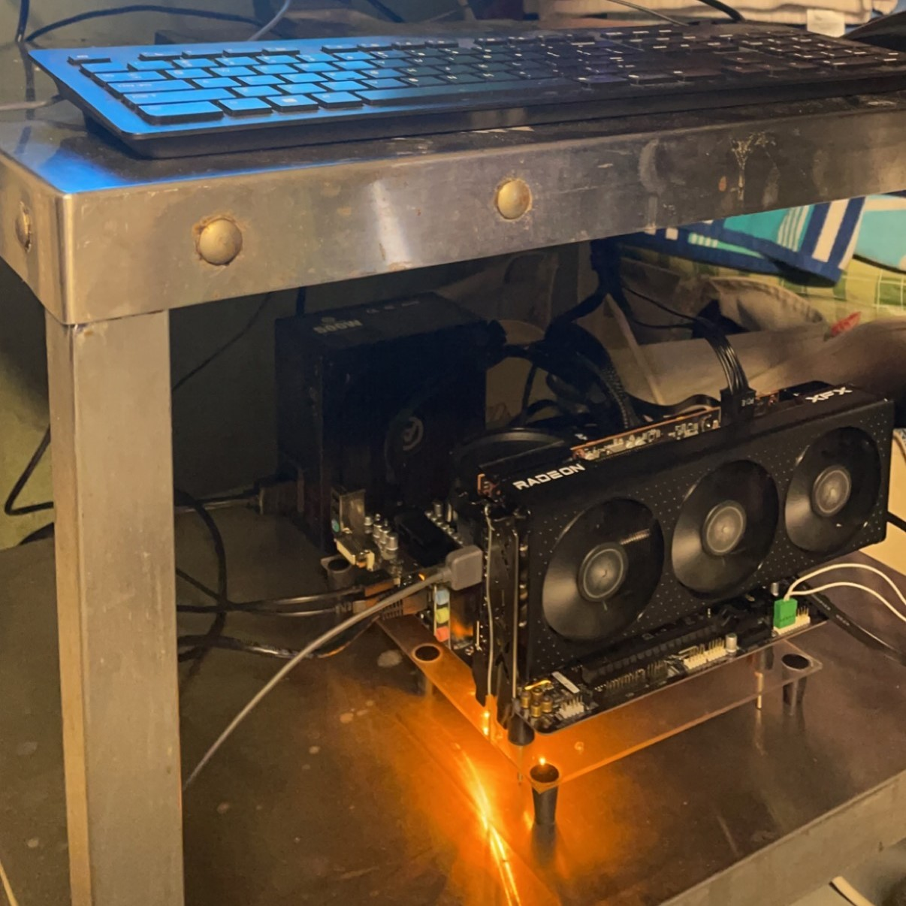
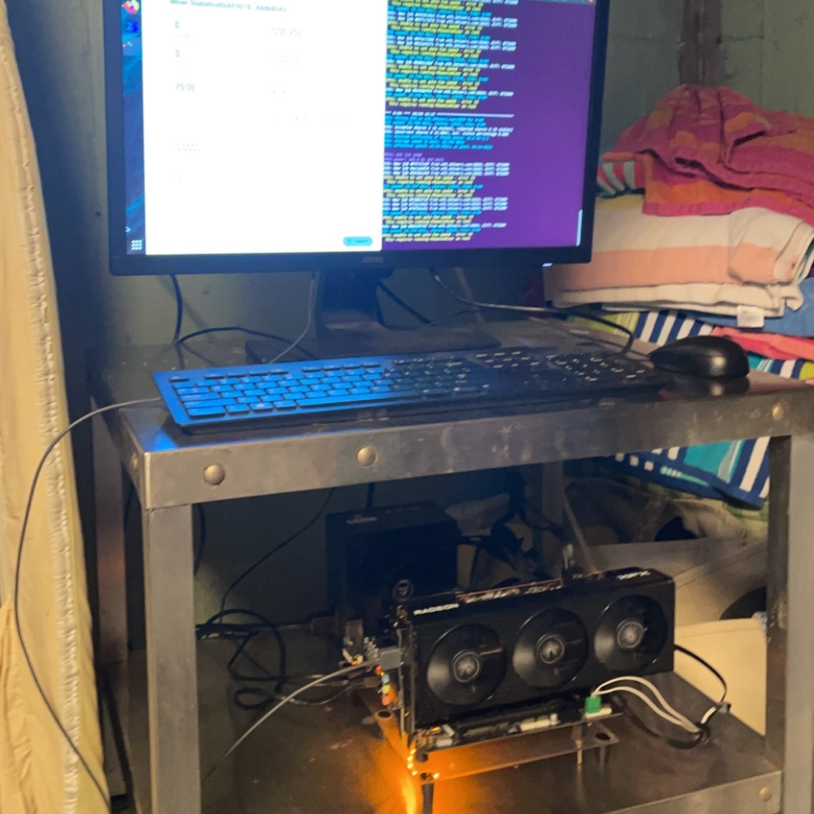

# My Linux PC

Enjoy some pics & diagrams on my custom Ubuntu machine and everything I've done with it!

## Hardware

| Component     | Model     |
|:--------------|:----------|
| Motherboard | Gigabyte B450M DS3H |
| RAM | Corsair Vengeance LPX 16GB |
| CPU | AMD Ryzen 3 1200 |
| CPU Cooler | *Fan came with CPU |
| Power Supply | ARESGAME 500W Power Supply |
| GPU | AMD Radeon 6600 XT |
| Storage | WD Black Series 500 GB HDD |

## OS

Ubuntu 20.04

### To install Ubuntu Linux on a PC (new builds):
https://www.youtube.com/watch?v=X_fDdUgqIUQ
1. Download Ubuntu https://ubuntu.com/download/desktop
2. Download Rufus https://rufus.ie/en/
3. Insert a USB storage device and use Rufus to turn it into an Ubuntu bootable
4. Plug the USB into your new PC and turn it on
5. Select Ubuntu
6. You can choose to try it first or install it - eventually you want to install it
7. When you install Ubuntu, you’ll want to select Minimal Installation and uncheck the boxes for updates & third-party software

# Pics

